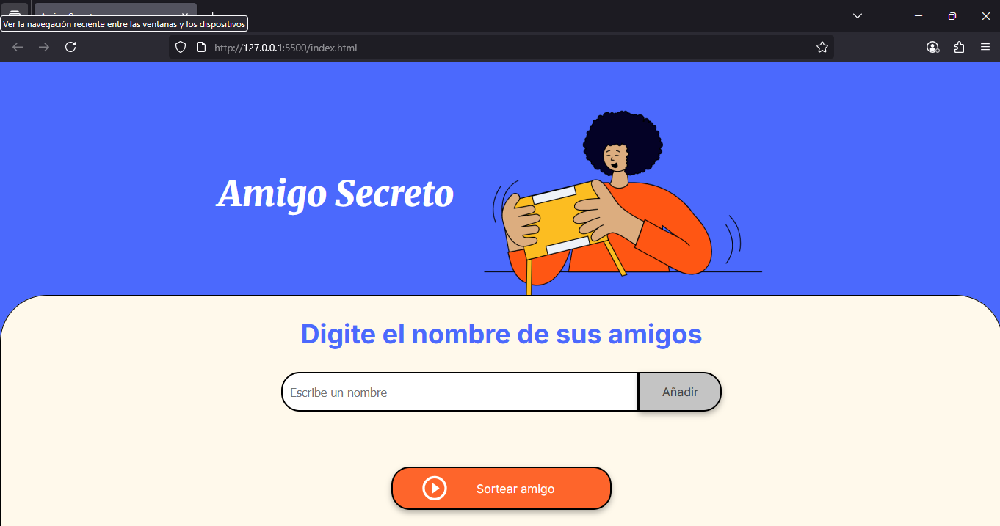
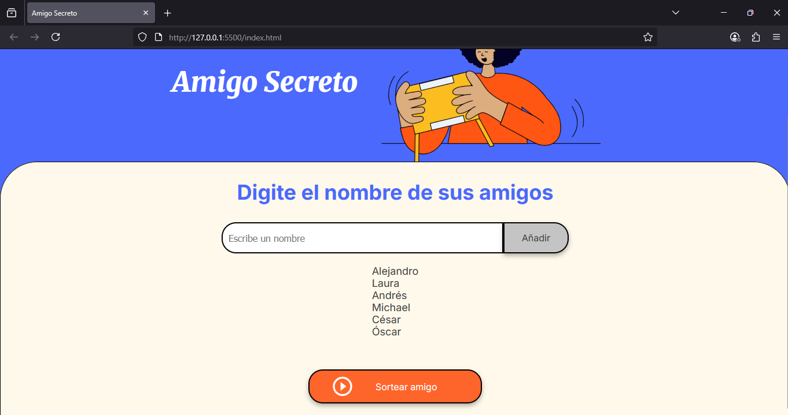
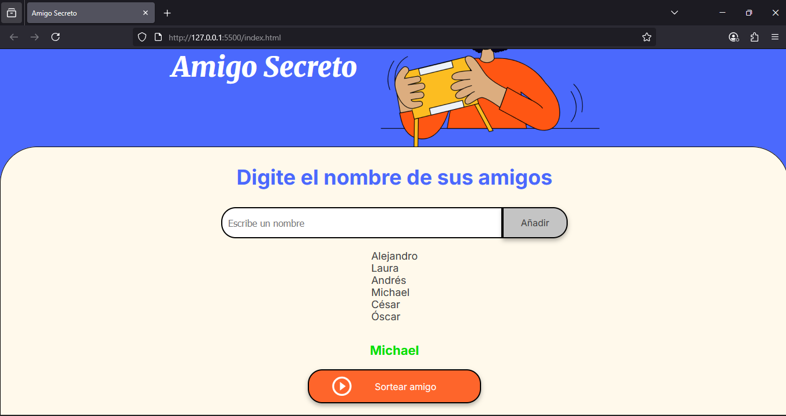
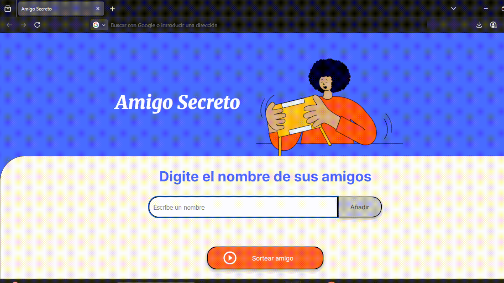

# 🎁 Challenge del Amigo Secreto

¡Bienvenido al **Challenge del Amigo Secreto**!  
Este es un pequeño juego web donde puedes escribir los nombres de tus amigos, hacer clic en un botón, y el sistema elegirá uno de ellos al azar para asignarle un reto sorpresa. Ideal para romper el hielo o animar cualquier reunión 🎉.

---

## ✨ Características

- ✅ Interfaz sencilla e intuitiva.
- 🧑‍🤝‍🧑 Permite agregar múltiples nombres.
- 🔄 Selección aleatoria con un solo clic.
- 🎲 Perfecto para jugar en reuniones o en línea con amigos.

---

## 📸 Interfaz del juego

-
¿Quién gastará el helado?
-
JUAN LO GASTA! jajaja
-

## Video de uso

<div align="center">
  
</div>


---

## 🚀 Cómo usar

1. Abre el proyecto en tu navegador.
2. Escribe los nombres de los participantes en la casilla de input.
3. Haz clic en el botón "Elegir amigo secreto".
4. ¡Mira quién fue elegido y disfruta del reto!

---

## 🛠️ Tecnologías Usadas

- HTML5
- CSS3
- JavaScript (Vanilla)

---

## 📦 Instalación y Uso Local
- **En linux:** ejecutar este comando en la terminal.
```bash
    git clone https://github.com/Tdristados/Challenge-Amigo-Secreto.git
    cd Challenge-Amigo-Secreto
    open index.html
```
- **En Windows:** ejecutar este comando en el powerShell.
```bash
    git clone https://github.com/Tdristados/Challenge-Amigo-Secreto.git
    cd Challenge-Amigo-Secreto
    start index.html
``` 
